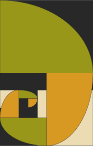

# chameleon

A fully featured UCI chess engine written in Rust, with the goal to experiment around Opponnent Model Search, and to be the engine used in the BEAUB project.

# Table of contents
- [Table of contents](#table-of-contents)
- [Description](#description)
- [Usage](#usage)
- [License](#license)

# Description
[Back to top](#table-of-contents)

Chameleon is a chess engine implementing the UCI protocol.

It is mainly meant to be a toy project to learn Rust and general low-level programming concepts, as well as a way to apply advanced game theory algorithms and newly researched concepts in the field when some catch my interest.

On a secondary note, it will be used in parallel with [RCB](https://github.com/AloisRautureau/reed-chessboard) to power BEAUB, a chess playing robot.

# Usage
[Back to top](#table-of-contents)

You can either compile the source code from main using `cargo build --release`, or use the latest [release](https://github.com/AloisRautureau/chameleon-engine/releases/tag/v1).

The first option is likely to give you the best performance, cargo being able to optimize for your CPU's architecture directly.

The engine can then be used with a UCI-compatible chess GUI of your choice, or standalone as a CLI application. A list of UCI commands can be found [here](http://wbec-ridderkerk.nl/html/UCIProtocol.html) if you want to go with the latter.

# License
[Back to top](#table-of-contents)

The engine is under the MIT license, which is particularily permissive. To put it simply, you are free to reuse the code and assets in this repository as you please!

Don't forget to give credit where credit is due, by providing a link to this repository for example :)